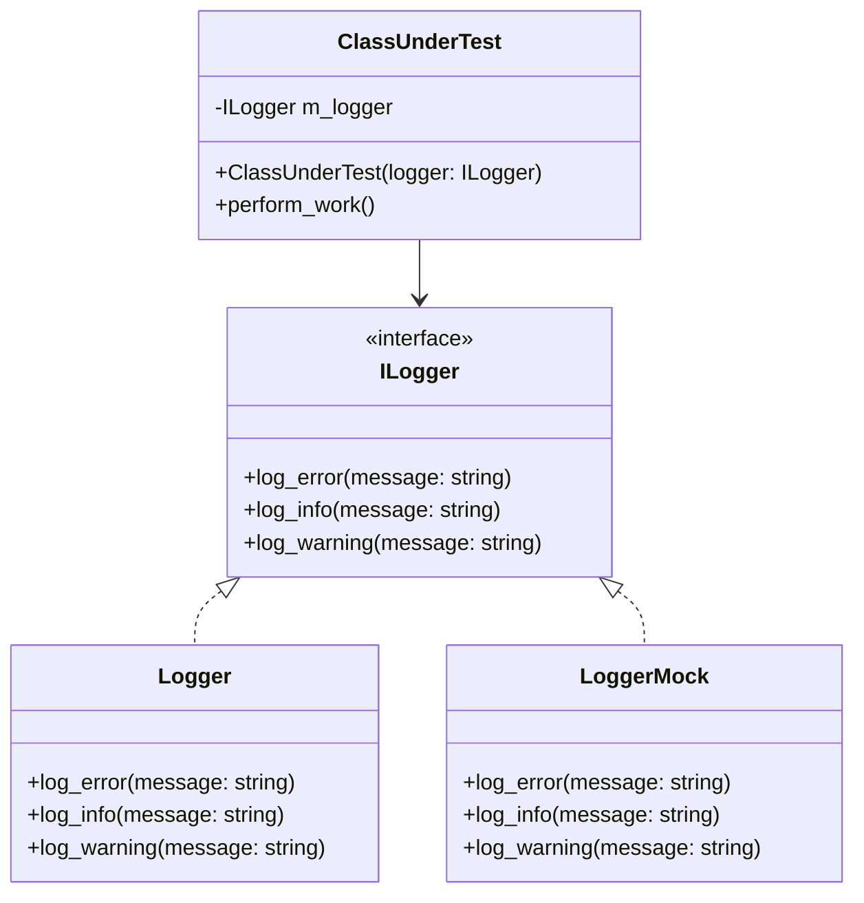

Google Test is an extremely powerful tool, jam packed with tons of different
tools and resources to ensure engineers are able to thoroughly test their codebase.
Through using it more often at work, I found it carries a steeper learning curve
compared to other testing libraries. The
[Macro Expansion](https://gcc.gnu.org/onlinedocs/cppinternals/Macro-Expansion.html)
Google Test employs to design reusable code templates for compile time interpretation
is an ingenious and highly scalable design, but often leaves an IDE temporarily confused
and with an indirect error message. Additionally, incorrect type comparisons with assertions
can yield unruly messages, making it difficult to pinpoint which comparison is the faulty one.
There are many more struggles I have personally noticed when using Google Test, however
with time and a deeper understanding, I have found these debugging sessions have slowly
dwindled in time. Additionally, having a deeper understanding on how Google Test works
encouraged me to begin writing tests that are simple, consistent, and reliable!

In this post, I am going to cover the very basics of Google Test that proved to be helpful
for me when writing unit tests. I am also going to describe a few practices I discovered
that can help with effectively testing code.

## Why Do We Test?

Regression to me is one of the more important reasons to test code. Imagine you are
onboarded onto a team that maintains a multimillion line codebase. You are given a task
to add a feature to an internal library that is widely used throughout the code base. Your
feature has to modify pre-existing code as well as adding in new code. The added code creates
a branching condition based on the context in which the method is called. With unit tests,
you would be able to modify the pre-existing code with higher confidence that the change will
not adversely affect other use cases.

What if you do not have unit or integration tests to refer to? When the code is untested,
it can be a huge undertaking to modify the behavior of the code, especially if you are new to
the code base. It will be harder to determine if the changes you are making are
correct. Tests help alleviate this issue. When writing a feature, by capturing the
behavior of your code in tests, you help the next engineer as well as creating a safety net
to ensure new code does not degrade the existing functionality.

## How I Like to Structure Test Cases - AAA

I added this section on the top as it is a design I try to actively keep in my tests I write.
The structure is:
[`Arrange, Act, and Assert`](https://thinkster.io/tutorials/blogs/the-aaa-structure-of-tests).
It encourages that all tests have these three distinct sections. Often times,
I have found a relatively basic method or function that needs testing. For example:

```cpp
int add(int lhs, int rhs);

TEST(MathTests, CanPerformAddition) {
  EXPECT_EQ(add(5, 6), 11);
}
```

There is nothing inherently incorrect with this test, although it would probably be better
if it were parameterized. It calls the function under test, providing the necessary inputs,
and asserts that the result of the function call matches the literal value provided
on the right hand side: `11`. Although this test is fine and tests a valid condition,
consider a different test case that is more complicated. In more complicated functions or
objects, it largely helps other programmers to read the test and understand it based on
pre-defined expectations for the structure of the code.

```cpp
int add(int lhs, int rhs);

TEST(MathTests, CanPerformAddition) {
  // Arrange
  constexpr auto lhs{ 5 };
  constexpr auto rhs{ 6 };
  constexpr auto expected{ 11 };

  // Act
  const auto actual{ add(lhs, rhs) };

  // Assert
  EXPECT_EQ(actual, expected);
}
```

Although slightly more verbose, it layouts very specific expectations:

- `Arrange:` Here are the known inputs used for the test.
- `Act:` This is the item to invoke or act upon.
- `Assert:` These are the expected results and state after acting.

## ASSERT vs EXPECT

In the `Assertion` stage of a test, Google Test offers two comparison functions:
`ASSERT_*` and `EXPECT_*`. `ASSERT_*` is a blocking operation: if the comparison
is invalid, then the test will not continue running beyond that point. For `EXPECT_*`,
it is a non-blocking comparison. If the comparison fails, it will fail the test but continue
to run until a crash or end of test. My rule of thumb is to use `ASSERT` when there is
a critical section that cannot continue if it is invalid. Use `EXPECT` for non-critical
sections where a failed check does not break the rest of the code.

An example of a critical section could be establishing a connection to a database.

```cpp
TEST(DatabaseTest, DatabaseReturnsProperNumberOfUsers) {
  // Arrange
  DatabaseObject db;
  ASSERT_TRUE(db.connect()); // if connection can't be established, we cannot test.
  const auto expected_number_of_users{ 10 };

  // Act
  const auto actual_number_of_users{ db.execute_query("SELECT * FROM users") };

  // Assert
  EXPECT_TRUE(db.is_valid()); // Multiple conditions, non-blocking.
  EXPECT_TRUE(expected_number_of_users, actual_number_of_users);
}
```

## Mocking Dependencies

Mocking dependencies is another crucial aspect of unit testing. It is often
the most difficult to do if the code has not been unit tested from the beginning as
it requires a specific design to mock a dependency. Consider the following example:

```cpp
class ClassUnderTest {
public:
  ClassUnderTest() {
    m_logger = std::make_unique<Logger>();
  }

  void perform_work() {
    if (work_invalid) {
      m_logger->log_error("Work could not be performed.");
      return;
    }
    // Rest of code.
  }

private:
  std::unique_ptr<Logger> m_logger;
};
```

Like the unit test example showcasing the AAA unit test pattern, the above class
is sound. If there is an error condition from the hypothetical work to be performed,
we log the error and then exit the method early. Otherwise, we perform the work.

Currently, there is no way to check that `m_logger->log_error` was called. Additionally,
it may not be feasible to create a `Logger` object in a test environment. The logger
could potentially talk to a server on the cloud, or perform a miscellaneous number of
other checks we don't necessarily care about when testing the functionality inside of
our `ClassUnderTest`.

What would be ideal is that we are able to substitute our implementing class with a mock or
a [stub](https://spring.io/blog/2007/01/15/unit-testing-with-stubs-and-mocks).




By converting the dependency to be an interface, we are able to inject different
implementations of the logger. This means in the release build we can swap `ILogger`
with the `Logger` class and during testing we can inject the `LoggerMock` version.

```cpp
class LoggerMock {
public:
  MOCK_METHOD(void, log_info, (const std::string& message), (override));
  MOCK_METHOD(void, log_error, (const std::string& message), (override));
  MOCK_METHOD(void, log_error, (const std::string& message), (override));
};
```

This allows us to better test the expectations of our class under test when calling
dependencies.

### Pass the dependency as an argument in the constructor

The first step is to allow `ILogger` injection. One way to achieve this is to
pass the `ILogger` argument through the constructor.

```cpp
class ClassUnderTest {
public:
  ClassUnderTest(std::shared_ptr<ILogger> logger) : m_logger(std::move(logger)) {}
  // ...

private:
  std::shared_ptr<ILogger> m_logger;
};
```

`m_logger` is a shared pointer to allow for injecting a singleton or new instance. It could also
be represented as a raw pointer or week pointer.

```cpp

using testing::NiceMock;
using testing::_;

TEST(PerformWork, PerformWorkIsInvalid) {
  // Arrange
  auto mock_logger = std::make_unique<NiceMock<LoggerMock>>();
  EXPECT_CALL(*mock_logger, log_error(_)).Times(1);

  auto classUnderTest = ClassUnderTest(std::move(mock_logger));
  // create error state ...

  // Act
  classUnderTest.perform_work();

  // Assert
  // Check no work has been performed.
}

TEST(PerformWork, PerformWorkIsValid) {
  // Arrange
  auto mock_logger = std::make_unique<NiceMock<LoggerMock>>();
  EXPECT_CALL(*mock_logger, log_error(_)).Times(0);
  EXPECT_CALL(*mock_logger, log_info(_)).Times(0);
  EXPECT_CALL(*mock_logger, log_warning(_)).Times(0);

  auto classUnderTest = ClassUnderTest(std::move(mock_logger));

  // Act
  classUnderTest.perform_work();

  // Assert
  // Check that work has been performed.
}
```

## Sub-classing

Sub-classing is a great tool to have for testing, especially for front end components
that sometimes require modifying / accessing UI input fields and buttons. For a UI
component, we generally do not want to expose the components. However, for testing,
we may need access to a button's signal or a user input field to test a certain state.

Consider the following code:

```cpp
// MyClass.hpp
#include <QWidget>

namespace Ui {
class MyClass;
}

class MyClass : public QWidget {
    Q_OBJECT
public:
    explicit MyClass(QWidget *parent = nullptr);
    ~MyClass() = default;

signals:
    void formResultsReady(const std::string& form);

private:
    std::unique_ptr<Ui::MyClass> m_ui;
};
```

For unit testing the above class, it would be nice to test these two behaviors:

1. Valid `formResultsReady` condition.
2. Invalid `formResultsReady` condition.

For the purpose of this example, let's say the UI component has a few fields. In order for a form to be valid
and ready, a user must enter valid inputs into two fields: a name that does not consist of numbers and an age
that does not consist of characters. Additionally, they must click the `Finish` button. If these conditions are
not met when the `Finish` button is pressed, then a text will appear on the widget describing the error.

Since `m_ui` is private, we cannot access it in our tests. C++ also does not have reflection, so it is out of the
question to use a tool like [GetType](https://learn.microsoft.com/en-us/dotnet/api/system.type.getfields?view=net-8.0)
to access the private members. So how do we solve this issue? We can leverage sub-classing. It would require making the
`m_ui` member variable `protected` in the class and then creating a sub-class to help publicly expose it for
test environments.

```cpp
// MyClass.hpp
#include <QWidget>

namespace Ui {
class MyClass;
}

class MyClass : public QWidget {
    Q_OBJECT
public:
    explicit MyClass(QWidget *parent = nullptr);
    ~MyClass() = default;

signals:
    void formResultsReady(const std::string& form);

protected:
    std::unique_ptr<Ui::MyClass> m_ui;
};

```

Then, in our `MyClassTest.cpp` file, we can create the subclass that will expose the `m_ui` instance for the tests to leverage:

```cpp
// MyClassTest.cpp
namespace {

class MyClassSubclass : public MyClass {
  Q_OBJECT
public:
  using MyClass::MyClass;

  Ui::MyClass* getUI() const {
    return m_ui.get();
  }
};

}

#include "MyClassTest.moc"
```

An example of a test:

```cpp
TEST(MyClassTest, ValidInputFieldsEmitFormResultsReady) {
  // Arrange
  MyClassSubclass classUnderTest;
  const auto ui{ classUnderTest.getUI() };
  ui->nameField->setText("Kyle");
  ui->ageField->setText("25");

  QSignalSpy spyButtonClicked(ui->finishButton, &QPushButtonClicked);
  QSignalSpy spyFormResultsReady(&classUnderTest, &MyClass::formResultsReady);

  // Act
  QTest::mouseClick(ui->finishButton, Qt::LeftButton);

  // Assert
  EXPECT_EQ(spyButtonClicked.count(), 1);
  ASSERT_EQ(spyFormResultsReady.count(), 1);

  const auto arguments = signalSpy.takeFirst();
  EXPECT_EQ(arguments.at(0).toString().toStdString(), "Expected String");
}
```

## Different Types of Google Tests

Below are the three primary forms of Google Tests: `Global Tests`, `Test Fixtures`, `Parameterized Tests`, and `Typed Tests`.

### Global Tests

Global Tests are the simplest tests Google provides. It is typically used for tests that do not require
a set up or a teardown. All the above examples used global tests, however some also could benefit
from utilizing a different test type! Examples of tests that would not need extensive set up or tear down
would be:

- Standalone functions that do not have a wide range of inputs.
- An exquisite edge case.
- Determining if a function result can be evaluated at compile time.

`Note:` For determining if a function result can be evaluated at compile time, this is an example I would consider
to be an `exquisite edge case`. It may still be necessary to test the inputs and outputs of a wide
range of values at run time, however a standalone test to determine that the function works at
compile time would be an excellent idea to ensure compile time support.

```cpp
// Functions under test
std::string greet(const std::string& name);
constexpr int factorial(int n);

// Testing Greeting Function
TEST(GreetTest, ReturnsGreeting) {
  // Arrange
  const std::string input{ "World" };
  const std::string expected_output{ "Hello, World!" };

  // Act
  const auto actual_output{ greet(input) };

  // Assert
  EXPECT_STREQ(expected_output.c_str(), actual_output.c_str());
}

// Testing Compile-Time Evaluation
Test(FactorialTests, FactorialCanBeEvaluatedAtCompileTime) {
  // Arrange
  constexpr auto n{ 4 };
  constexpr auto expected{ 24 };
  // Act
  constexpr auto actual{ factorial(n) };

  // Assert
  static_assert(expected == actual);
}
```

### Fixture Tests

Fixture Tests are a great tool for classes / environments that require additional setup or teardown. It can also
be a great tool for constructing your class to be in a testable state. Some examples where test fixtures
can be useful are:

- Dealing with IO bound resources.
- Preparing a lot of mocks.
- Multiple tests that need a shared resource.

In the above example where I discussed mocking the [Logger](#pass-the-dependency-as-an-argument-in-the-constructor)
class, I had two situations that became a repetitive task in the global tests.

1. The `LoggerMock` object was created.
2. The `ClassUnderTest` object was created and the `LoggerMock` was passed in as a dependency.

In this situation, the creation of the `LoggerMock` is considered a shared resource for any test that
needs to create a `ClassUnderTest` instance. By utilizing a test fixture, the test can be less focused
on properly creating the required objects and more focused towards arranging, acting, and asserting the
behaviors.

```cpp
namespace {

using testing::Test;
using testing::NiceMock;

}

class MyClassTest : public Test {
protected:
  MyClassUnderTest() {
    auto logger_mock = std::make_unique<NiceMock<LoggerMock>>();
    m_logger_mock = logger_mock.get();
    m_my_class_under_test = std::make_unique<MyClass>(std::move(logger_mock));
  }

  // Mocked Dependencies
  LoggerMock* m_logger_mock;

  // Class Under Test
  std::unique_ptr<MyClass> m_my_class_under_test;
};
```

The following test fixtures are now able to perform tests without instantiating objects to test against,
or instantiating the test object itself.

```cpp
TEST_F(MyClassTest, PerformWorkIsInvalid) {
  // Arrange
  EXPECT_CALL(*m_logger_mock, log_error(_)).Times(1);
  // create error state ...

  // Act
  m_class_under_test->perform_work();

  // Assert
  // Check no work has been performed.
}

TEST(MyClassTest, PerformWorkIsValid) {
  // Arrange
  EXPECT_CALL(*m_logger_mock, log_error(_)).Times(0);
  EXPECT_CALL(*m_logger_mock, log_info(_)).Times(0);
  EXPECT_CALL(*m_logger_mock, log_warning(_)).Times(0);

  // Act
  m_class_under_test->perform_work();

  // Assert
  // Check that work has been performed.
}
```

### Parameterized Tests

Parameterized Tests allow you to use the same test logic against a wide range of inputs.
It behaves very similar to a test fixture, with the exception of being able to instantiate a
test suite with a multitude of inputs.

Let's assume we want to test `factorial`. We have a lot of inputs we can test against with expected outputs.
Here is an example on how that could look.

```cpp
namespace {

using testing::TestWithParam;
using testing::ValuesIn;

struct FactorialParams {
  int input{};
  int expected{};
};

const std::vector<FactorialTestParams> factorial_test_cases = {
    {0, 1},
    {1, 1},
    {2, 2},
    {3, 6},
    {4, 24},
    {5, 120},
    {6, 720}
};

}

class FactorialTests : public TestWithParam<FactorialParams> {};

TEST_P(FactorialTests, TestFactorial) {
  // Arrange
  const auto& param = GetParam();

  // Act
  const auto actual{ factorial(param.input) };

  // Assert
  EXPECT_EQ(param.expected, actual);
}

INSTANTIATE_TEST_SUITE_P(
    MyParamTestInstance,
    MyParamTest,
    ValuesIn(factorial_test_cases)
);
```

### Typed Tests

Typed Tests are great for testing templated code in which it needs to be tested against multiple different
types. An unfortunate limitation with GTest comes with parameterizing typed tests: it isn't something that
is easy to do and also not directly supported by the library. For that reason, it isn't really ideal
to test functions like factorial (if it were templated) using typed tests. Due to the wide range
of inputs a function like that would need to be tested against, it would most likely be better to create
multiple `TestWithParam` inputs and have duplicate class instantiations. For example, if we wanted to
test the `factorial` function with integer and float values, we could modify the original example to the following:

```cpp
namespace {

template <typename T>
struct FactorialTestParams {
  T input{};
  T expected_output{};
};

const std::vector<FactorialTestParams<int>> factorial_test_params_int{
  // ...
};

const std::vector<FactorialTestParams<double>> factorial_test_params_double{
  // ...
};

}

class FactorialIntegerTests : public TestWithParam<FactorialParams<int>> {};
class FactorialDoubleTests : public TestWithParam<FactorialParams<double>> {};

INSTANTIATE_TEST_SUITE_P(FactorialIntTests, FactorialIntegerTests, ::testing::ValuesIn(factorial_test_params_int));
INSTANTIATE_TEST_SUITE_P(FactorialDoubleTests, FactorialDoubleTests, ::testing::ValuesIn(factorial_test_params_double));

TEST_P(FactorialIntegerTests, HandlesFactorial) {
  // Arrange
  const auto& param = GetParam();
  // Act
  const auto actual{ factorial(param.input) };
  // Assert
  EXPECT_EQ(actual, param.expected_output);
}

TEST_P(FactorialDoubleTests, HandlesFactorial) {
  // Arrange
  const auto& param = GetParam();
  // Act
  const auto actual{ factorial(param.input) };
  // Assert
  EXPECT_EQ(actual, param.expected_output);
}
```

A great example of when a typed test can come is handy is when testing a data structure like a queue, stack, list,
or set! Below is an example of a set, where we test that inserting a default type multiple times yields no duplicate
items in the set. It is tested against an `int`, `std::string`, and custom `MyClass`.

```cpp
namespace {

using testing::Types;
typedef Types<int, std::string, MyClass> TestTypes;

}

TYPED_TEST_SUITE(SetUnionTests, TestTypes);

TYPED_TEST(SetUnionTests, DuplicateInsertsOfSets) {
  Set set;
  TypeParam object{};
  EXPECT_TRUE(set.empty());
  set.insert(object);
  EXPECT_EQ(set.size(), 1);
  set.insert(object);
  EXPECT_EQ(set.size(), 1);
}
```

## Presentation Slides

<iframe src="/assets/img/blog/2024-07-24-gtest-examples/gtest-examples-slide.pdf" width="100%" height="500px"></iframe>
