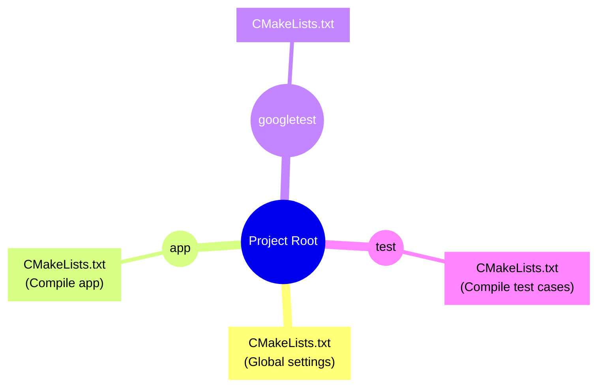
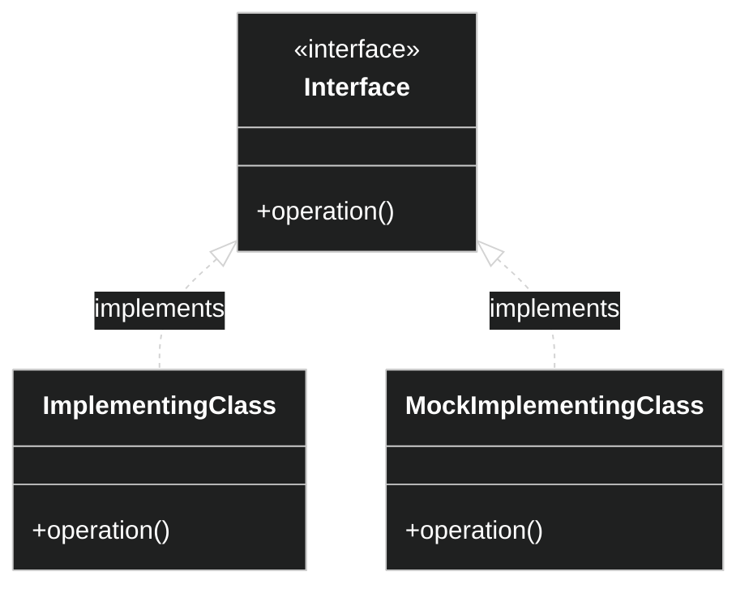
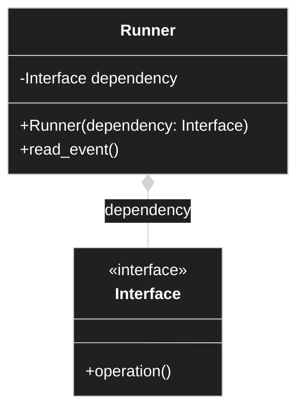

In a recent side project, I developed an
[audible altimeter](https://github.com/khurd21/Audible-Altimeter) for skydiving.
The altimeter serves as an audible aid, speaking to skydivers as they fall through the sky.
It is comprised of three primary components:

- [Tiny2350](https://shop.pimoroni.com/products/tiny-2350?variant=42092638699603)
- [Speaker](https://www.adafruit.com/product/1891)
- [Barometric Pressure Sensor](https://www.adafruit.com/product/4816?gad_source=1&gclid=Cj0KCQiAuou6BhDhARIsAIfgrn41aeigv4DYtKF1sWzfQuBm2cryZL2P8o6fYxWa7l3xvQCfxeu2tjcaAvwWEALw_wcB)

While planning this project, it was clear that there were two aspects to designing this tool.
There was figuring out the embedded side, how we communicate with the systems described above,
and then there was implementing the software logic based on the results of the above components.
The embedded side included the following problems to solve:

- How to play audio data through a speaker.
- How to properly read the sensor data from the altimeter.

Beyond that, the rest of the logic can be implemented without needing to communicate with
an external device. For example,

- How to convert pressure and temperature data into feet/meters and fahrenheit/celsius.
- When to report each altitude reading to the skydiver.

There are far more sections of the software that we are able to test. However, it is not
possible to test the components that communicate with an external device or sensor. Additionally,
while planning the project and understanding what sensors and speakers were going to be chosen
for the audible altimeter, it wasn't strictly necessary to need to implement the class that will
gather the data or speak to the speaker. It was necessary though to design and implement the
skeleton and structure for how we want to use these classes.

## High Level Overview of Project Design

When contemplating the project design, I was inspired by
[this solution](https://lochnerweb.de/index.php/pico_unit_testing). The article describes
an ingenious solution to testing your code: if the project is being built in an environment
that excludes the Pico device, then it will simply not include the files associated with the
Pico build. This is achieved by passing an argument to `cmake` during its configuration step,
that allows cmake to determine the build type and filter certain sections of the build. In this design,
they architected the following project structure:



Although the above solution is sound, I disliked the design for this following reasons:

1. The raw values `0`, `1`, and `2` representing each build type confused me considerably.
I found myself forgetting what build target was associated with each number.
2. Having a `CMakeLists.txt` file that can change from an `executable` to a `library` depending
on the build target was also a confusing concept. It felt wrong that a project could switch between
the two.
3. The solution relies on the developer wrapping code specific to the pico-sdk inside of a
`#ifdef PICO`. While sometimes necessary in C/C++ programming, it felt unneeded in this context.

As a result of the following design practices I did not agree with, I decided to employ the following
design choice. A detailed overview of this design can be found in the
[Audible Altimeter Wiki](https://github.com/khurd21/Audible-Altimeter/wiki/UML-Diagrams)d

## Dependency Injection

In order to write good unit tests for the project, I leveraged a powerful concept called
[Dependency Injection](https://www.freecodecamp.org/news/a-quick-intro-to-dependency-injection-what-it-is-and-when-to-use-it-7578c84fa88f/#:~:text=In%20software%20engineering%2C%20dependency%20injection,not%20particularly%20easy%20to%20understand.).
In it, we define an interface which serves as a barrier between the embedded code and
the software. This interface is used as a way to substitute the implementing class (most likely
represented as a stub or mock). 



This interface can then be injected into the classes we write that implements the behavior
of the audible altimeter. In this project, the `Runner` class is what handles the behavior
and state. The `Runner` takes each interface in the constructor and uses them when necessary
while the system is running. The `Runner` is what will be unit tested.



## Example With Code

Below is an example of an interface defined in the audible altimeter project. The `IBarometricSensor`
serves as a barrier between the communication with the `BMP390` and the rest of the code. The interface
is relatively simple: it defines a struct `SensorData` that holds the raw temperature and pressure data
from the device. Additionally, it holds a public pure virtual method, `get_sensor_data`, that returns
the `SensorData` from the device, if able. The decision to make this method return an optional field
was to account for a few edge cases that may or may not occur:

1. The device we are getting the data from cannot be accessed.
2. The device is connected but is not yet ready to deliver the data.
3. Some unknown error occurred and there is not a high level of certainty the data is accurate.

```cpp
class IBarometricSensor {
 public:
  ~IBarometricSensor() = default;

  struct SensorData {
    SensorData() = default;
    explicit SensorData(double temperature, double pressure)
        : temperature(temperature), pressure(pressure) {}

    double temperature{};
    double pressure{};
  };

  virtual std::optional<SensorData> get_sensor_data() = 0;
};
```

The `BMP390` class implements the interface using code from the
[BMP390 Sensor API](https://github.com/boschsensortec/BMP3_SensorAPI). In this class, the constructor
attempts to ping the device and set up instructions for how to retrieve the information from the
sensor. It communicates with the actual device and is to be used in a real application setting.

```cpp
class BMP390 : public IBarometricSensor {
 public:
  BMP390();
  std::optional<SensorData> get_sensor_data() override;

 private:
  bmp3_dev m_bmp3;
  bmp3_settings m_settings{0, 0, 0};
};
```

The `MockBarometricSensor` class is the mocked version of the interface. With this class,
we can unit test the components that depend of the `IBarometricSensor` without having to
rely on properly connecting to the device. Additionally, we can simulate scenarios of a skydive
much better by returning different data from the `get_sensor_data` method.

```cpp
class MockBarometricSensor final : public IBarometricSensor {
 public:
  MOCK_METHOD(std::optional<IBarometricSensor::SensorData>, get_sensor_data, (),
              (override));
};
```

Finally, the `AltimeterData` is an example of a class that depends on the implementation of the
interface, `IBarometricSensor`. `AltimeterData` is a class that wraps the barometric sensor data
and offers a higher level of abstraction in regards to the data it provides. Instead of delivering
the raw data of the sensor, it interprets the data and provides more useable information. For example,
instead of reporting pressure data, it interprets the pressure and converts it into meters or feet above
ground level. Additionally, for temperature, it converts the data into either an imperial or metric format.

Due to the added complexity of this class, there are a lot of behaviors that we can test. To list a few,
we can assert that:

- The `MeasurementSystem` specified in the constructor or setter is correct when calling
`AltimeterData::get_data()`.
- The first call of `AltimeterData::get_data()` returns 0 for the altitude.
- As the pressure increases or decreases from the sensor, the altitude also changes.
- As the temperature rises or falls, the reported temperature will also rise or fall.
- `AltimeterData::get_data()` returns `std::nullopt` when an error condition occurs
reading the sensor data.


```cpp
class AltimeterData {
 public:
  enum class MeasurementSystem {
    Imperial,
    Metric,
  };

  struct GatheredData {
    int altitude{};
    int temperature{};
    MeasurementSystem measurement_system{MeasurementSystem::Imperial};
  };

  AltimeterData() = default;
  explicit AltimeterData(
      IBarometricSensor* sensor,
      MeasurementSystem system = MeasurementSystem::Imperial);

  std::optional<GatheredData> get_data() const;
  void set_measurement_system(MeasurementSystem system);

 private:
  int convert_temperature(double temperature_c) const;
  int calculate_altitude(double pressure_pa, double temperature_c) const;

  IBarometricSensor* m_sensor = nullptr;
  MeasurementSystem m_measurement_system{MeasurementSystem::Imperial};
  mutable std::optional<double> m_baseline_pressure;
  mutable std::optional<double> m_baseline_temperature;
};
```

## Writing the Test Case

The following example is adapted from the
[Altimeter Data Tests](https://github.com/khurd21/Audible-Altimeter/blob/main/Audible-Altimeter/test/altimeter_data_tests.cpp).
In this example, the `MockBarometricSensor` is used to mock the dependency inside of our object
under test, `AltimeterData`.

```cpp
template <typename T>
class AltimeterDataBaseTests : public TestWithParam<T> {
 protected:
  AltimeterDataBaseTests() {
    m_altimeter_data_under_test = AltimeterData(&m_mock_barometric_sensor);
  }

  void set_measurement_system(AltimeterData::MeasurementSystem system) {
    m_altimeter_data_under_test =
        AltimeterData(&m_mock_barometric_sensor, system);
  }

  AltimeterData m_altimeter_data_under_test;
  MockBarometricSensor m_mock_barometric_sensor;
};
```

```cpp
class AltimeterDataTemperatureTests
    : public AltimeterDataBaseTests<TemperatureValues> {};

TEST_P(AltimeterDataTemperatureTests, Temp) {
  const auto& params{GetParam()};
  set_measurement_system(params.measurement_system);
  EXPECT_CALL(m_mock_barometric_sensor, get_sensor_data)
      .WillOnce(Return(IBarometricSensor::SensorData(
          params.input_data.temperature, params.input_data.pressure)));

  const auto result{m_altimeter_data_under_test.get_data()};

  ASSERT_TRUE(result.has_value());
  EXPECT_EQ(result->temperature, params.expected_data.temperature);
}

INSTANTIATE_TEST_SUITE_P(TemperatureTests, AltimeterDataTemperatureTests,
                         ValuesIn(get_temperature_test_data()));
```

## Setting up the CMake

When setting up the project structure, the projects depend on a argument parameter, `IS_PICO`.
When `IS_PICO` is defined in the cmake, then we build the project for the pico-sdk. For example,
for the embedded library:

```cmake
if (${IS_PICO})
    # Make a static library for the embedded code
    add_library(${LIB_NAME} STATIC ${sources} ${includes})
    add_library(${LIB_NAME}::Audible-Altimeter-Embedded ALIAS ${LIB_NAME})
    target_include_directories(${LIB_NAME} PUBLIC ${include_dir})
    target_link_libraries(${LIB_NAME} PUBLIC
        Audible-Altimeter::Audible-Altimeter
        hardware_i2c
        hardware_dma
        hardware_pio
        hardware_gpio
        hardware_clocks
        pico_stdlib
        BMP3_SensorAPI::BMP3_SensorAPI
        )
    pico_generate_pio_header(${LIB_NAME} ${CMAKE_CURRENT_SOURCE_DIR}/i2s.pio)

    target_include_directories(${LIB_NAME} PUBLIC ${include_dir})

    target_include_directories(${LIB_NAME} PRIVATE ${CMAKE_CURRENT_SOURCE_DIR}/../../Audible-Altimeter/include)
endif()
```

Additionally, for the executable project, we wrap the creation of the executable in the `IS_PICO`
argument.

```cmake
if (${IS_PICO})

set(EXE_NAME Audible-Altimeter-Executable)

add_executable(${EXE_NAME}
    main.cpp
    )

# Modify the below lines to enable/disable output over UART/USB
pico_enable_stdio_uart(${EXE_NAME} 0)
pico_enable_stdio_usb(${EXE_NAME} 1)

# pull in common dependencies
target_link_libraries(${EXE_NAME}
    Audible-Altimeter::Audible-Altimeter
    Audible-Altimeter-Embedded::Audible-Altimeter-Embedded
    )

# create map/bin/hex file etc.
pico_add_extra_outputs(${EXE_NAME})

endif()
```

Finally, the general audible altimeter project doesn't utilize the `IS_PICO` and simply defines
the library containing components that don't directly depend on communicating with an external
sensor.

```cmake
set(LIB_NAME Audible-Altimeter)

set(include_dir ${CMAKE_CURRENT_SOURCE_DIR}/../include)
set(sources
    altimeter_data.cpp
    runner.cpp
    audio_player.cpp
    )

set(includes
    ${include_dir}/Audible-Altimeter/altimeter_data.hpp
    ${include_dir}/Audible-Altimeter/runner.hpp
    ${include_dir}/Audible-Altimeter/device_description_interface.hpp
    ${include_dir}/Audible-Altimeter/barometric_sensor_interface.hpp
    ${include_dir}/Audible-Altimeter/timer_interface.hpp
    ${include_dir}/Audible-Altimeter/audio_driver_interface.hpp
    ${include_dir}/Audible-Altimeter/audio_player.hpp
    )

set(AUDIO_INPUT_DIR ${PROJECT_SOURCE_DIR}/assets)
set(AUDIO_OUTPUT_DIR ${CMAKE_BINARY_DIR}/generated)

file(GLOB AUDIO_WAV_FILES "${AUDIO_INPUT_DIR}/*.wav")
set(AUDIO_CPP_FILES)
foreach(wav_file IN LISTS AUDIO_WAV_FILES)
    get_filename_component(filename ${wav_file} NAME_WE)
    list(APPEND AUDIO_CPP_FILES "${AUDIO_OUTPUT_DIR}/${filename}.cpp")
endforeach()

file(MAKE_DIRECTORY ${AUDIO_OUTPUT_DIR})
add_custom_command(
    OUTPUT ${AUDIO_CPP_FILES}
    COMMAND python3 ${PROJECT_SOURCE_DIR}/scripts/convert_audio_to_code.py
            ${AUDIO_INPUT_DIR} ${AUDIO_OUTPUT_DIR}
    DEPENDS ${AUDIO_WAV_FILES}
    COMMENT "Converting .wav files to .cpp files"
)

add_custom_target(generate_audio_files ALL
    DEPENDS ${AUDIO_CPP_FILES}
)

add_library(${LIB_NAME} STATIC ${sources} ${includes} ${AUDIO_CPP_FILES})
add_library(${LIB_NAME}::Audible-Altimeter ALIAS ${LIB_NAME})
add_dependencies(${LIB_NAME} generate_audio_files)

target_include_directories(${LIB_NAME} PUBLIC ${include_dir})
target_include_directories(${LIB_NAME} PUBLIC ${AUDIO_OUTPUT_DIR})
```
